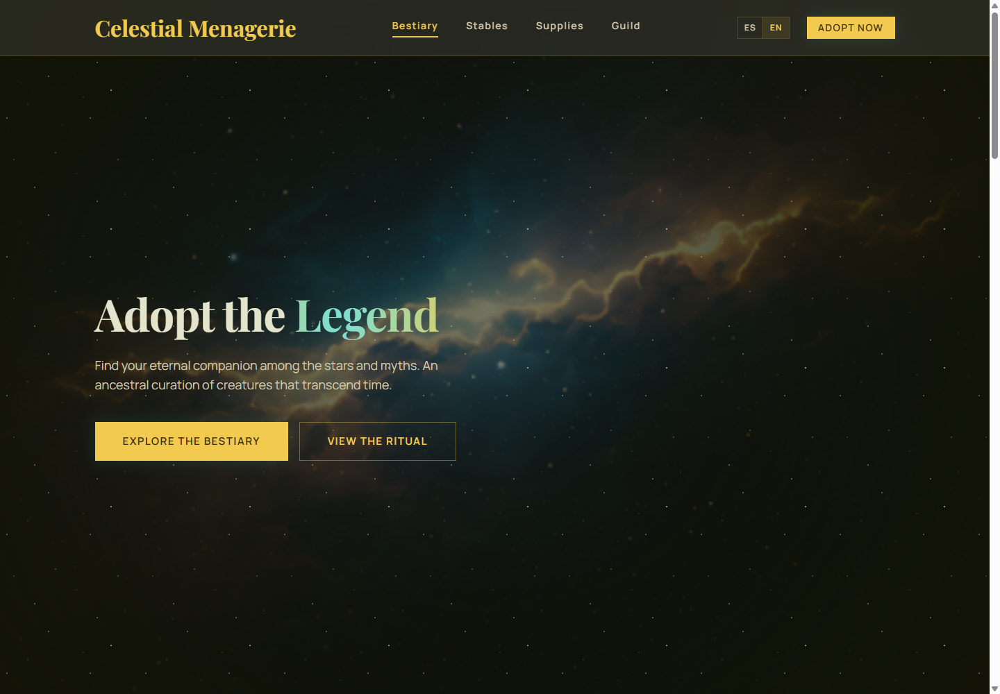
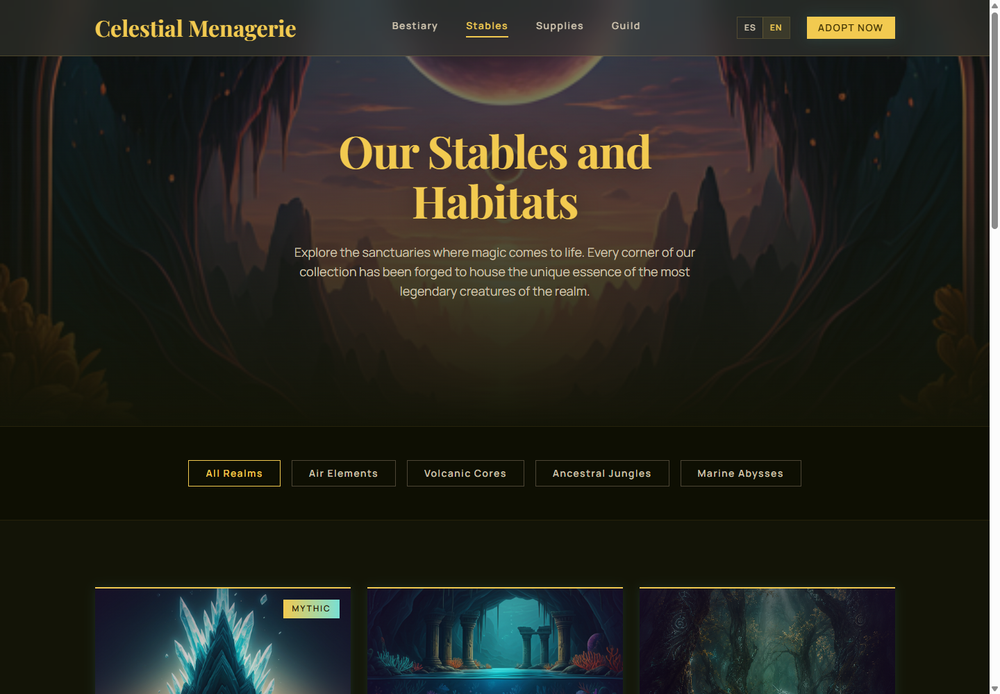
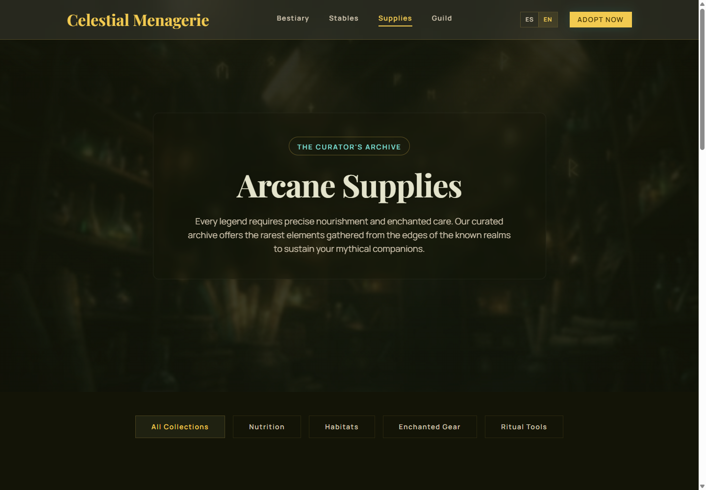
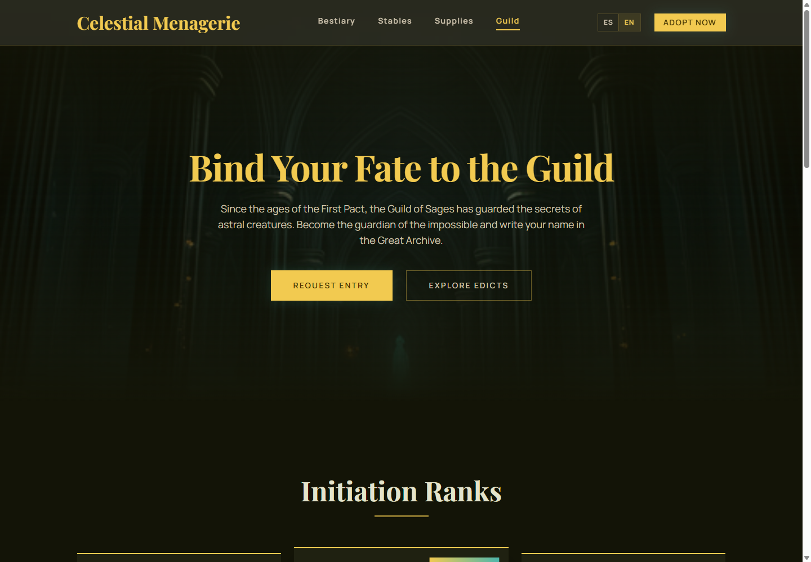

# Celestial Menagerie

A dark fantasy storefront concept built with React, Vite, TypeScript and Material UI.

Celestial Menagerie is a multi-page frontend experience for a fictional marketplace of mythological creatures, arcane habitats, magical supplies and guild memberships. It was designed as a portfolio project to showcase visual direction, modular React architecture, custom theming, routing, internationalization and deployment-ready static hosting.

## Preview



Additional screens:







## Overview

This is a static SPA created as a portfolio frontend project. It is not a full production e-commerce platform with backend services, authentication, cart persistence or payments. The goal is to showcase a polished multi-page interface, component composition, theming and a deployment-ready frontend structure.

## Live Demo

Coming soon.

Planned deployment:

- GitHub Actions for CI/CD
- Amazon S3 as the static hosting origin
- Amazon CloudFront as the CDN
- CloudFront invalidation after each deployment
- SPA fallback to `index.html` for client-side routes

## Features

- Multi-page React SPA
- Route-aware navigation
- Dark celestial fantasy visual identity
- Custom MUI theme with extended palette tokens
- Responsive layouts across desktop and mobile
- Internationalization with Spanish and English locales
- Local image assets organized by feature
- Modular architecture by domain section
- Reusable global layout with navbar and footer
- Portfolio-ready visual direction beyond generic dashboard layouts

## Pages

- `/` - Bestiary landing page
- `/stables` - Mythical habitats and stables
- `/supplies` - Arcane supplies catalog
- `/guild` - Guild registry and membership tiers

## Tech Stack

- React 18
- Vite 5
- TypeScript
- Material UI 6
- Emotion
- React Router DOM
- i18next
- react-i18next

## Project Structure

```text
src/
  core/
    components/
      navbar/
      footer/
    layouts/
      mainLayout/
    locales/
      es/
      en/
    router/
    theme/
  modules/
    landing/
    stables/
    supplies/
    guild/
  assets/
    landing/
    stables/
    supplies/
    guild/
```

## Architecture

The project separates shared infrastructure from feature-specific code.

`src/core` contains global app concerns such as the theme, router, layouts, shared components and localization setup.

`src/modules` contains domain pages and components. Each section of the experience lives in its own module, keeping the codebase easier to navigate and extend.

This structure makes the app closer to a maintainable production frontend than a single-file landing page.

## Design System

The interface uses a custom dark fantasy theme built on top of Material UI.

Main visual traits:

- Dark near-black backgrounds
- Gold and teal celestial accents
- Playfair Display for headings
- Manrope for body and UI text
- Glassmorphism navigation
- Glowing CTA buttons
- Mythical product and creature cards
- Atmospheric gradients and nebula-style imagery

The theme extends the MUI palette with custom celestial tokens used across the UI.

## Internationalization

The app supports Spanish and English through `i18next` and `react-i18next`.

Locale files live in:

```text
src/core/locales/es/landing.locale.ts
src/core/locales/en/landing.locale.ts
```

Visible copy is managed through translation keys instead of hardcoded JSX strings.

## Local Development

Install dependencies:

```bash
yarn install
```

Start the development server:

```bash
yarn dev
```

Create a production build:

```bash
yarn build
```

Preview the production build:

```bash
yarn preview
```

## Deployment Plan

The intended deployment flow is:

1. Push changes to GitHub.
2. GitHub Actions installs dependencies.
3. GitHub Actions runs `yarn build`.
4. The generated `dist/` folder is uploaded to an S3 bucket.
5. CloudFront serves the S3 origin globally.
6. A CloudFront invalidation refreshes cached assets after deployment.

For client-side routing, CloudFront should be configured so routes like `/guild`, `/stables` and `/supplies` resolve to `index.html`.

## Portfolio Notes

This project demonstrates:

- Translating a visual concept into a React application
- Building a cohesive themed UI with MUI
- Structuring a frontend by feature modules
- Handling route-aware navigation
- Managing multilingual content
- Preparing a static SPA for cloud deployment
- Creating a distinctive interface beyond generic storefront layouts

## Roadmap

Potential improvements:

- Mobile drawer navigation
- Active filter behavior for catalog sections
- Basic cart interaction prototype
- Accessibility pass for focus states and keyboard navigation
- GitHub Actions deployment workflow
- CloudFront and S3 production configuration
- Lighthouse performance review

## Status

Portfolio polish in progress.
